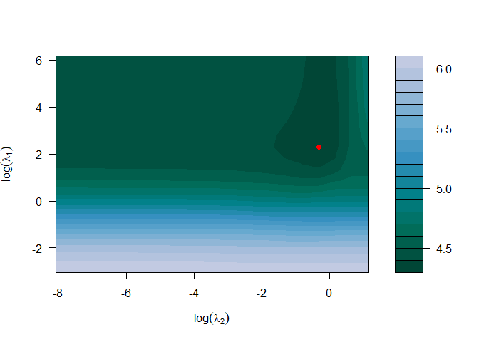

xrnet: R Package for Hierarchical Regularized Regression
================

<!-- README.md is generated from README.Rmd. Please edit that file -->

[](https://travis-ci.org/USCbiostats/hierr)
[](https://ci.appveyor.com/project/gmweaver/hierr)
[](https://codecov.io/gh/USCbiostats/hierr)
[](https://www.tidyverse.org/lifecycle/#experimental)

# Introduction

The **xrnet** R package is an extension of regularized regression
(i.e. ridge regression) that enables the incorporation of external data
that may be informative for the effects of predictors on an outcome of
interest. Let \(y\) be an n-dimensional observed outcome vector, \(X\)
be a set of *p* potential predictors observed on the *n* observations,
and \(Z\) be a set of *q* external features available for the *p*
predictors. Our model builds off the standard two-level hierarchical
regression
model,


but allows regularization of both the predictors and the external
features, where beta is the vector of coefficients describing the
association of each predictor with the outcome and alpha is the vector
of coefficients describing the association of each external feature with
the predictor coefficients, beta. As an example, assume that the outcome
is continuous and that we want to apply a ridge penalty to the
predictors and lasso penalty to the external features. We minimize the
following objective function (ignoring intercept
terms):


Note that our model allows for the predictor coefficients, beta, to
shrink towards potentially informative values based on the matrix \(Z\).
In the event the external data is not informative, we can shrink alpha
towards zero, returning back to a standard regularized regression. To
efficiently fit the model, we rewrite this convex optimization with the
variable subsitution \(gamma = beta - Z * alpha\). The problem is then
solved as a standard regularized regression in which we allow the
penalty value and type (ridge / lasso) to be
variable-specific:


This package extends the coordinate descent algorithm of Friedman et
al. 2010 (used in the R package **glmnet**) to allow for this
variable-specific generalization and to fit the model described above.
Currently, we allow for continuous and binary outcomes, but plan to
extend to other outcomes (i.e. survival) in the next release.

# Setup

1.  For Windows users, install
    [RTools](https://cran.r-project.org/bin/windows/Rtools/) (not an R
    package)
2.  Install the R package [devtools](https://github.com/hadley/devtools)
3.  Install xrnet package with the install\_github function (optionally
    install most recent / potentially unstable development branch)

<!-- end list -->

``` r
# Master branch
devtools::install_github("USCbiostats/xrnet")

# Or the development branch
devtools::install_github("USCbiostats/xrnet", ref = "development")
```

4.  Load the package

<!-- end list -->

``` r
library(xrnet)
```

# A First Example

As an example of how you might use the xrnet package, we have provided a
small set of simulated external data variables (ext), predictors (x),
and a continuous outcome variable (y). First, load the example data:

``` r
data(GaussianExample)
```

#### Fitting a Model

To fit a linear hierarchical regularized regression model, use the main
`hierr` function. At a minimum, you should specify the predictor matrix
`x`, outcome variable `y`, and `family` (outcome distribution). The
`external` option allows you to incorporate external data in the
regularized regression model. If you do not include external data, a
standard regularized regression model will be fit. By default, a ridge
penalty is applied to the predictors and a lasso penalty is applied to
the external data.

``` r
xrnet_model <- hierr(x = x_linear, 
                     y = y_linear, 
                     external = ext_linear, 
                     family = "gaussian")
```

#### Modifying Regularization Terms

To modify the regularization terms and penalty path associated with the
predictors or external data, you can use the `define_penalty` function.
This function allows you to configure the following regularization
attributes:

  - Regularization type
      - Ridge = 0
      - Elastic Net = (0, 1)
      - Lasso / Quantile = 1 (additional parameter `quantile` used to
        specify quantile)
  - Penalty path
      - Number of penalty values in the full penalty path (default = 20)
      - Ratio of min(penalty) / max(penalty)
  - User-defined set of penalties

As an example, we may want to apply a ridge penalty to both the x
variables and external data variables. In addition, we may want to have
30 penalty values computed for the regularization path associated with
both x and external. We modify our model fitting as follows.

``` r
myPenalty <- define_penalty(penalty_type = 0, 
                            penalty_type_ext = 0, 
                            num_penalty = 30, 
                            num_penalty_ext = 30)

xrnet_model <- hierr(x = x_linear, 
                     y = y_linear, 
                     external = ext_linear, 
                     family = "gaussian", 
                     penalty = myPenalty)
```

#### Tuning Penalty Parameters by Cross-Validation

In general, we need a method to determine the penalty values that
produce the optimal out-of-sample prediction. We provide a simple
two-dimensional grid search that uses k-fold cross-validation to
determine the optimal values for the penalties. The cross-validation
function `cvhierr` is used as follows.

``` r
cvxrnet <- cv_hierr(x = x_linear, 
                    y = y_linear, 
                    external = ext_linear, 
                    family = "gaussian")
```

To visualize the results of the cross-validation we provide a contour
plot of the mean cross-validation error across the grid of penalties
with the `plot` function.

``` r
plot(cvxrnet)
```

<!-- -->

The `predict` function can be used to predict responses and to obtain
the coefficient estimates (or the `coef` function) at the optimal
penalty combination (default) or any other penalty combination.

``` r
predy <- predict(cvxrnet, newdata = x_linear)
estimates <- coef(cvxrnet)
```
